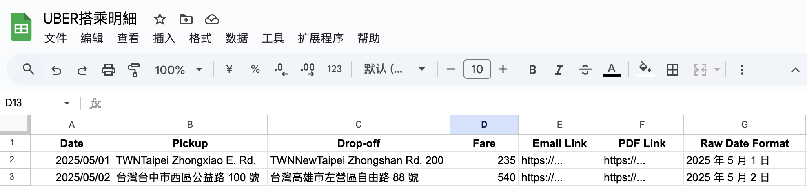

# 🚗 Uber Receipt Fetcher (Google Apps Script)

This tool **automatically fetches Uber ride receipt emails from Gmail**, extracts trip details (date, pickup location, drop-off location, fare), and writes them into a designated Google Sheet sorted by date. It supports extracting multiple formats of Uber PDF links.

---

## 📌 Overview

| Feature             | Description                                         |
| ------------------- | --------------------------------------------------- |
| 📬 Source           | Uber receipt emails with subject containing "搭乘的行程" |
| 📅 Extracted Fields | Date, Pickup, Drop-off, Fare, Email Link, PDF Link  |
| 📊 Output           | Google Sheet (named `UBER搭乘明細`)                     |

---

## ✅ Implemented Features

* Automatically searches Uber ride emails from the past `100 days` (configurable)
* Skips already-processed emails (based on Gmail permalink)
* Extracts key information:

  * 🚩 Date (converted to `Date` object)
  * 📍 Pickup and drop-off locations (handles mixed region code formats)
  * 💰 Fare amount (as number only)
  * 📎 PDF receipt link
  * 🔗 Gmail permalink for reference
* Appends data to Google Sheet and sorts by date (ascending)
* Can run daily using Apps Script time triggers

---

## 🧠 Challenges & Solutions

### 1. PDF Link Format Variability

Uber provides PDF receipts as in-email hyperlinks instead of file attachments. These links vary in format:

* `https://email.mgt.uber.com/...`
* `https://click.uber.com/...`
* `https://email.uber.com/ls/click?...`
* `https://tracking.ibt.uber.com/tracking/1/click/...`

📌 This script implements **multi-layer fallback parsing** to ensure accurate retrieval.

### 2. Mixed Address Formats

Pickup/drop-off addresses may appear in different formats:

* Starting with `台灣`, e.g., "台灣桃園市..."
* With a `TWN` prefix, e.g., "TWN台北市..."
* With `TW+City` prefix, e.g., "TWTaipei新北市..."

📌 The script prioritizes addresses beginning with "台灣" and supplements with TWN/TW-prefixed variants when necessary, with noise filtering via regex.

---

## 📁 Output Format (Google Sheet)

| Column Name     | Description                                   |
| --------------- | --------------------------------------------- |
| Date            | `Date` object (sortable)                      |
| Pickup          | Detected start location                       |
| Drop-off        | Detected destination                          |
| Fare            | Numeric amount only                           |
| Email Link      | Gmail message permalink                       |
| PDF Link        | Link to Uber receipt PDF                      |
| Raw Date Format | Original date string (e.g., "2025 年 3 月 4 日") |

---

## 🧩 Dependencies

* Google Apps Script (Gmail API, Spreadsheet API)
* Regex-based HTML parsing of email body content

---

📄 The spreadsheet **must be named `UBER搭乘明細`**. Suggested column headers:

| A    | B      | C        | D    | E          | F        | G               |
| ---- | ------ | -------- | ---- | ---------- | -------- | --------------- |
| Date | Pickup | Drop-off | Fare | Email Link | PDF Link | Raw Date Format |

📌 Sample Screenshot:

---

## 👩‍💻 Author & Maintainer

Created and maintained by [CynthiaYenJuChen](https://github.com/CynthiaYenJuChen). Feel free to fork, modify, or submit PRs/Issues 🙌

---

## 🈁 中文版本說明（Traditional Chinese）

請參見 `README.zh.md`。

---
